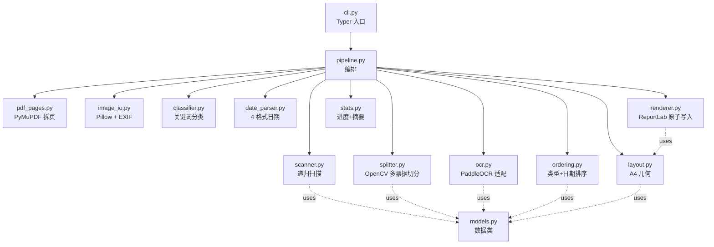

# CLAUDE.md — fapiao 项目地图

> 离线 Python CLI：递归扫描发票/订单图片与 PDF，本地 PaddleOCR 识别类型与日期，按"类型分组 + 日期升序"合并为 A4 竖版可打印 PDF。
>
> **最后更新**：2026-05-06 21:00 +0800

## 1. 项目快照

| 项 | 值 |
|---|---|
| 入口 | `fapiao` console script (`pyproject.toml::project.scripts`) → `fapiao_pdf.cli:app` |
| Python | 3.11 – 3.13（PaddlePaddle 3.x 暂无 cp314 wheel） |
| 包布局 | `src/` layout，hatchling 构建 |
| 测试 | pytest + Hypothesis；230 passed, 1 skipped（含 Web 模式 ~150 项） |
| 规格 | OpenSpec `openspec/changes/merge-invoice-order-images-pdf/`（isComplete=true） |
| 真机基准 | 5 张样本 24 秒（mobile 模型，CPU，禁用 oneDNN） |

## 2. 关键命令速查

```bash
# 一次性环境准备
py -3.13 -m venv .venv
.venv/Scripts/python.exe -m pip install -e ".[dev]"
.venv/Scripts/python.exe -m pip install paddlepaddle -i https://www.paddlepaddle.org.cn/packages/stable/cpu/
.venv/Scripts/python.exe -m pip install paddleocr --prefer-binary

# 首次模型下载（约 250MB → ~/.paddlex/official_models/）
.venv/Scripts/fapiao.exe init

# 端到端合并
.venv/Scripts/fapiao.exe merge ./samples -o ./out.pdf --force --pdf-dpi 200

# Web 模式（FastAPI + SPA，仅本机回环）
.venv/Scripts/fapiao.exe serve --host 127.0.0.1 --port 8000

# 测试
.venv/Scripts/python.exe -m pytest tests/ -q

# 合成样本
.venv/Scripts/python.exe scripts/gen_samples.py samples
```

## 3. 模块依赖图



## 4. 端到端数据流

```
用户目录
  ↓ scanner.scan_directory_with_warnings
List[Path]                                    # 大小写不敏感扩展名过滤、跳过符号链接/特殊文件
  ↓ pdf_pages.iter_pages | image_io.load_image
List[_LogicalImage(LogicalInput, PIL.Image)]  # PDF 拆页 / EXIF 转置
  ↓ splitter.split_page
List[_LogicalImage]                            # 多票据 → 多 crop；低置信回退整页
  ↓ ocr.OcrEngine.recognize
List[OcrResult]                                # 失败/空文本计入 ocr_failures
  ↓ classifier.classify + date_parser.parse_first_valid_date
List[ProcessedDocument]                        # 类型 + 日期；OCR 失败降级为 order 无日期
  ↓ ordering.sort_documents
List[ProcessedDocument]                        # 发票优先 → 组内日期升序 → display_key 兜底
  ↓ layout.plan_pages
List[LayoutPage]                               # 发票 1-2 张/页，订单 1 张/页，A4 竖版
  ↓ renderer.render_pdf
output.pdf                                     # 临时文件 + os.replace 原子写入
  ↓ stats.aggregate + format_summary
"共处理 N 张，发票 X，订单 Y，OCR 失败 Z，输出至 <path>"
```

## 5. 模块导航

| 路径 | 职责 | 详细说明 |
|---|---|---|
| `src/fapiao_pdf/` | 主实现包 | [src/fapiao_pdf/CLAUDE.md](src/fapiao_pdf/CLAUDE.md) |
| `src/fapiao_pdf/web/` | FastAPI + SPA Web UI 子包 | [src/fapiao_pdf/web/CLAUDE.md](src/fapiao_pdf/web/CLAUDE.md) |
| `tests/` | 单元 + 集成测试 | [tests/CLAUDE.md](tests/CLAUDE.md) |
| `scripts/gen_samples.py` | 合成中文票据样本（PNG + PDF） | 单文件脚本，`python scripts/gen_samples.py <out_dir>` |
| `openspec/changes/merge-invoice-order-images-pdf/` | 设计与任务跟踪 | `proposal.md`、`design.md`、`tasks.md`、`specs/` |

## 6. 关键约束

### 6.1 OCR 行为

- **离线**：`merge` 阶段不联网；模型预下载到 `~/.paddlex/official_models/`
- **PIR 兼容补丁**：模块顶层 `os.environ.setdefault("FLAGS_use_onednn", "0")`；规避 PaddlePaddle 3.3+ 的 `ConvertPirAttribute2RuntimeAttribute` bug
- **默认 mobile 模型**：`PP-OCRv5_mobile_det/rec`；通过 `FAPIAO_OCR_MODEL=server` 切回大模型
- **失败语义**：异常或空文本计入 `ocr_failures`，文档降级为 `order` + 无日期
- **可注入引擎**：`OcrEngine` Protocol 允许测试用 `FakeOcrEngine`
- **Web 模式**：单 worker + lazy 单例 engine（`SerialMergeExecutor` 首次任务触发构建，后续复用），保证 PaddleOCR 线程安全

### 6.2 退出码

| 码 | 含义 |
|---|---|
| `0` | PDF 成功生成（即使部分文件失败） |
| `1` | 未发现支持文件，或所有文件均无法处理 |
| `2` | 参数错误 / 输出写入失败 / OCR 模型缺失 / 致命错误 |
| `130` | 用户 Ctrl+C |

### 6.3 版面规则

- A4 210×297 mm；10 mm 边距；发票上下间隙 5 mm
- 发票每页 ≤2 张；订单每页 1 张；不同类型不混排
- 等比缩放并居中，不超出可打印区域

### 6.4 排序规则

1. 类型组：`invoice` → `order`
2. 组内：有日期项按日期升序在前；无日期项在尾
3. 同序兜底：`display_key` 字典序

## 7. 环境变量

| 变量 | 默认 | 用途 |
|---|---|---|
| `PADDLE_OCR_CACHE_DIR` | 未设：扫描 `~/.paddlex/official_models/` 与 `~/.paddleocr/` | 自定义模型缓存目录 |
| `FLAGS_use_onednn` | `0`（fapiao 强制） | 关闭 oneDNN 绕过 PIR bug |
| `FLAGS_enable_pir_api` | `0`（fapiao 强制） | 关闭 PIR API 路径 |
| `FAPIAO_OCR_MODEL` | `mobile` | `server` 切回大模型 |
| `WEB_CONCURRENCY` | `1`（强制忽略外部值） | Web 模式强制单 worker，OCR 引擎单例 |

## 8. 开发约定

- **代码风格**：精简高效、无冗余；注释与文档非必要不写
- **测试边界**：纯函数全单元测试 + 端到端 fake OCR 集成测试；不做像素级 PDF 对比
- **OpenSpec 流程**：变更先在 `openspec/changes/` 提案，`tasks.md` 跟踪进度，`openspec status --change <name> --json` 校验完整性
- **风险动作**：不执行 git 提交、push、reset --hard 等危险操作除非用户显式要求

## 9. 详细文档入口

- [README.md](README.md) — 用户面向使用文档（13 节）
- [src/fapiao_pdf/CLAUDE.md](src/fapiao_pdf/CLAUDE.md) — 模块级 AI 上下文
- [tests/CLAUDE.md](tests/CLAUDE.md) — 测试组织
- [openspec/changes/merge-invoice-order-images-pdf/design.md](openspec/changes/merge-invoice-order-images-pdf/design.md) — 设计决策与替代方案

## .context 项目上下文

> 项目使用 `.context/` 管理开发决策上下文。

- 编码规范：`.context/prefs/coding-style.md`
- 工作流规则：`.context/prefs/workflow.md`
- 决策历史：`.context/history/commits.md`

**规则**：修改代码前必读 prefs/，做决策时按 workflow.md 规则记录日志。
